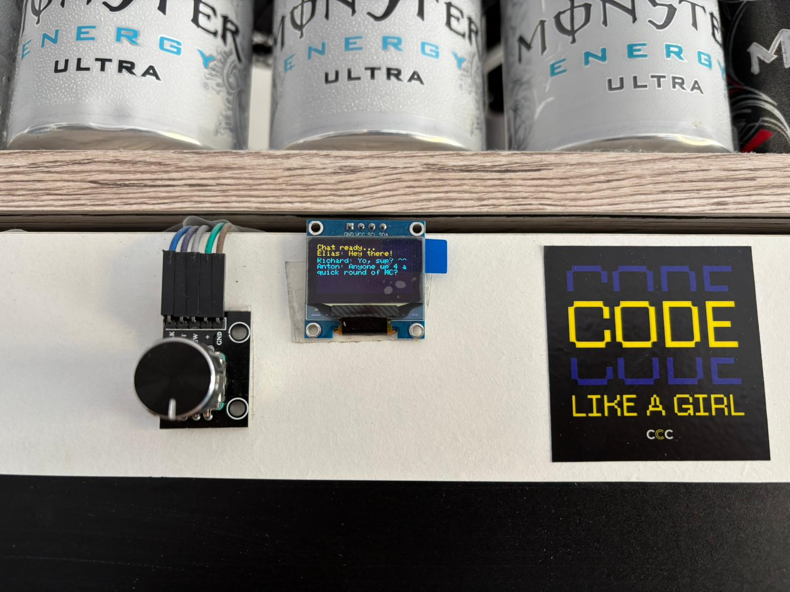

# 🚀 Campfire: An ESP32 Minimal WebSocket Chat

A ultra-lightweight, responsive, and mobile-friendly chat server running directly on an ESP32 (or other Microctonrollers ofc). It features a real-time web interface and a physical status display via I²C OLED.



## ✨ Features

* **Real-time:** Instant messaging using WebSockets (Port 81).
* **Responsive UI:** Mobile-first design with a dark theme.
* **Zero Configuration:** No external database or cloud services needed.
* **Usernames:** Prompt-based nickname selection on join.

## 🛠 Hardware & Software

* **Hardware:** ESP32 DevKit (or any ESP32 variant).
* **Framework:** Arduino.
* **Platform:** [PlatformIO](https://platformio.org/) (recommended).

## 📦 Dependencies

The project relies on the following library:

* [Links2004/WebSockets](https://github.com/Links2004/arduinoWebSockets)

## 🚀 Getting Started

### 1. Configure your WiFi

Open your main `.cpp` file and update the credentials:

```cpp
const char* ssid = "YOUR_WIFI_SSID";
const char* password = "YOUR_WIFI_PASSWORD";

```

### 2. PlatformIO Configuration (`platformio.ini`)

Ensure your configuration includes the library and the correct monitor speed:

```ini
[env:esp32dev]
platform = espressif32
board = esp32dev
framework = arduino
lib_deps = links2004/WebSockets@^2.7.3
monitor_speed = 115200

```

### 3. Flash & Run

1. Connect your ESP32 via USB.
2. Upload the code.
3. Open the **Serial Monitor** to find the IP address (e.g., `192.168.178.50`).
4. Enter the IP in any browser on the same network.

## 🌐 Port Forwarding (External Access)

To access the chat from outside your home network, you must forward **two ports** in your router settings to the ESP32's local IP:

* **Port 80 (TCP):** For the Web Interface.
* **Port 81 (TCP):** For the WebSocket data stream.

> [!WARNING]
> This server has no encryption (SSL/TLS). Use port forwarding only for testing purposes and disable it afterward.

## 📝 License

MIT - Feel free to use and modify for your own projects!